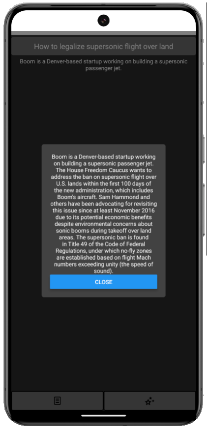
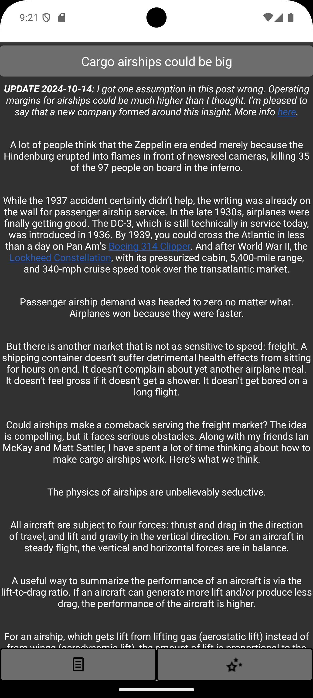
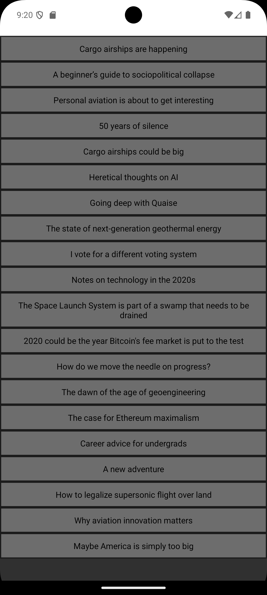
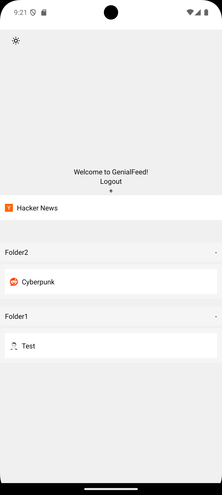

# Genial Feed

Genial Feed is an AI-based RSS Reader that works across devices.
It has the ability to make summaries of articles and to get articles from various sites, alongside creating feeds itself!

## To use yourself
While I do hope to be able to put this on the app store with [HackClub Cider](https://cider.hackclub.com/), it may not be available. If so, to use it yourself:

- Clone the repository
- Install [Expo](https://expo.dev)
- Go to [Firebase](https://firebase.google.com) and create a new project
- In `com.genialfeed.app` go to `firebase.js` and set the configs to your configs from firebase
- Get access to an endpoint that uses OpenAI-Esque API Schema (e.g. LMStudio, what I used). Set the url and necessary keys for that in the `BackendContainer\Backend\api.py`.
- Run `BackendContainer\Backend\api.py` with `uvicorn api:app --host 0.0.0.0` from `BackendContainer\Backend` and keep it running
- Run `npx expo start --go`, and you should be good to go!

Please note that web is *not* supported as of right now, however `oldweb` contains code for a basic web based RSS aggregator (not necessarily reader).

<video width="320" height="240" controls>
  <source src="https://github.com/MelonMars/GenialFeed/raw/refs/heads/main/genialfeed.com/demo.webm" type="video/webm">
  Your browser does not support the video tag.
</video>

